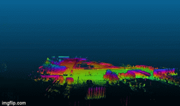

# Velodyne_tls

This study develops a method to acquire dense point clouds with a low-cost Velodyne VLP-16 lidar system, without using expensive GNSS positioning or IMU. Our setting consists in mounting the lidar on a motor to continuously change the scan direction, which leads to a significant increase in the point cloud density.  A post-treatment reconstructs the position of each point accounting for the motor angle at the time of acquisition, and a calibration step accounts for inaccuracies in the hardware assemblage. The system is tested in indoors settings such as buildings and abandoned mines, but is also expected to give good  results outdoors. 

The research associated with this work is available here : https://doi.org/10.5194/gi-9-385-2020, 2020
For any question please contact me on : jason.bula@unil.ch

Instructions to run the codes with the demo file

- First, download the example point cloud at this link: https://e.pcloud.link/publink/show?code=XZVD17ZUQLyMjOcDEHMXgtKtdvjNSA4E3pX
- The .pcap file must be in the same folder as main_demo.m
- The parameters for running the code have already been initialized and concern the rotation speed, motor synchronization, arm calibration and alpha1 parameters and alpha2.
- Run main_demo. This code create 16 ply files corresponding to the 16 bands of scan. These files can then ben merged.
- The optimisation parameters can be checked with the function calibration_alpha1.m and calibration_alpha2.m called by the calibration_demo.m file.

<h1>Instruction supplements for the use of the system in the field</h1>

<h2>Assembly of the system</h2>

1) Install the motor on the tripod
2) Place the slip ring and its metal rod on the motor.
3) Screw the lidar to the metal elbow. Caution: the lidar cable must point <b>exactly against the bottom</b> of the lidar. 
4) Connect the cables between the slip ring, lidar and power supply.
5) Connect the Ethernet cable to the laptop computer

Notes: By tightening the screws correctly, the backlash between the system components should be avoided as much as possible. The tripod does not necessarily need to be leveled, but it is preferable. 

<h2>Software :</h2>

1) Install the "Syrp Genie mini" application on a smartphone (tested on v2.7.6)
2) Install veloview (software present on the USB key provided with the lidar)
3) Download the demo file here : https://github.com/jason-bula/velodyne_tls/blob/master/demo_main.m and open it with Matlab

<h2>Example of configuration :</h2>
The acquisition time may vary, the slower the motor rotate, better is the resolution. Scans lasting between 3 and 6 minutes are preferable. To avoid measuring the acceleration and deceleration of the motor, the rotation is done on more than 360 degrees and is started before the acquisition. 

 
Table 1 : Configuration for a rotation of 3,4 and 6 minutes

| Rotation angle (degrees) | Acquisition time (s)  | Rotation time for 360 degrees (s) | Rotation speed: degree / second  |
| :---                      |     :---:             |          :---:                    |          ---:                      |
| 370                         |    370                   |   360                                |1                                    |
| 375                      | 250           | 240                                                          |1.5           |
| 380                      | 190         | 180                                                          |2             |

<h2>Acquisition on the field :</h2>
1) In the application Syrp Genie mini :
 <ol type="a">
   <li>Connect the smartphone to the motor</li>
   <li>Click on " video "</li>
 <li>	Set a rotation according to Table 1 for <b>clockwise</b> rotation (ie: 370 degree in 370 s)</li>
 </ol>

 2)	In Veloview :
 <ol type="a">
  <li>Open/Sensor Stream/VLP 16</li>
  <li>Record button/name the file (do not save yet)</li>
 </ol>

  

  
3) Taking measurements: be sure not to obstruct the field of view of the lidar.
<ol type="a">
  <li>Start the motor from "Syrp Genie Mini".</li>
  <li>According to the settings in table 1, you have <b>10 seconds</b> to press "save" in veloview</li>
  <li>Wait for the end of the scan</li>
  <li>Stop acquisition from veloview </li>

</ol>

 <h2> Post-processing of data acquired in the field</h2>
 
Calibration :
The system has been modified compared to the system presented in the article. The alpha 1 and alpha 2 parameters vary much less than in the previous version but can still be calibrated using the files: "Calibration_demo.m and alpha1/alpha2_calibration.m" https://github.com/jason-bula/velodyne_tls
To start the calibration, use Calibration_demo.m with the same parameters as for main_demo below.

1) Open main_demo in Matlab
<ol type="a">
  <li>Set input file directories (.pcap file)</li>
  <li>Set time variable in tenths of second : (ie: 3600 for 6min, 2400 for 4min and 1800 for 3min)</li>
  <li>Set the rotation angle (=360)</li>
  <li>Set time at the first frame (= 1)</li>
  <li>Set alpha1 and alpha2 = 0 (or with new calibration parameter)</li>
  <li>R = 0</li>
 </ol>
 

2) For the other parameter, read the comments in the code. These parameters can remain by default.

3) Run the script.</p)

Initially, the code generates 16 point clouds corresponding to each scan strip. These files can be easily merged to create a single high density point cloud. The point cloud can be denoised and assemble in CloudCompare.

